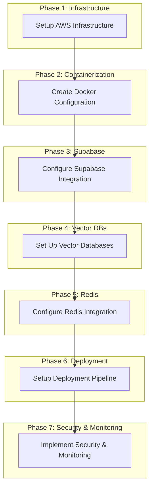

# Implementation Tasks

## Imperial Codex — Comprehensive Service Integration

---

## Task Dependency Graph



---

## Phase 1: Infrastructure Setup

### Task 1.1: AWS Account Setup
- **Priority**: Critical
- **Dependencies**: None
- **Estimated Time**: 2 hours

#### Description
Set up AWS account and configure IAM user with appropriate permissions for infrastructure provisioning.

#### Steps
1. Create AWS account if not already exists
2. Create IAM user with programmatic access
3. Attach `AdministratorAccess` policy for initial setup
4. Generate access keys and store in AWS Secrets Manager
5. Configure AWS CLI with the new credentials

#### Acceptance Criteria
- [ ] AWS account created and accessible
- [ ] IAM user created with programmatic access
- [ ] Access keys stored securely in AWS Secrets Manager
- [ ] AWS CLI configured and tested

#### Required Environment Variables
```bash
AWS_ACCESS_KEY_ID=your_access_key
AWS_SECRET_ACCESS_KEY=your_secret_key
AWS_DEFAULT_REGION=us-east-1
```

---

### Task 1.2: Provision AWS Resources
- **Priority**: Critical
- **Dependencies**: Task 1.1
- **Estimated Time**: 4 hours

#### Description
Provision EC2 instances, S3 buckets, RDS PostgreSQL, and configure IAM roles using Terraform.

#### Steps
1. Create Terraform configuration in `/infrastructure/` directory
2. Define EC2 instances (t3.xlarge for prod and staging)
3. Define S3 buckets (production, staging, backups)
4. Define RDS PostgreSQL instance (db.r6g.large with multi-AZ)
5. Define IAM roles (prod, staging, cron)
6. Define CloudWatch Logs and Alarms
7. Apply Terraform configuration

#### Terraform Structure
```
infrastructure/
├── main.tf
├── variables.tf
├── outputs.tf
├── ec2.tf
├── s3.tf
├── rds.tf
├── iam.tf
├── cloudwatch.tf
└── destroy.tf
```

#### Acceptance Criteria
- [ ] EC2 instances provisioned (prod and staging)
- [ ] S3 buckets created with proper naming
- [ ] RDS PostgreSQL instance running with multi-AZ
- [ ] IAM roles created with least-privilege permissions
- [ ] CloudWatch Logs configured with 90-day retention
- [ ] CloudWatch Alarms set up (CPU > 80%, error rate > 1%, DB connections > 80%)

---

### Task 1.3: Configure AWS Secrets Manager
- **Priority**: High
- **Dependencies**: Task 1.2
- **Estimated Time**: 2 hours

#### Description
Set up AWS Secrets Manager to securely store sensitive configuration values.

#### Steps
1. Create secret for Supabase service role key
2. Create secret for database passwords
3. Create secret for API keys (Qdrant, Pinecone)
4. Create secret for Redis connection string
5. Configure secret rotation policies

#### Acceptance Criteria
- [ ] Supabase service role key stored in Secrets Manager
- [ ] Database passwords stored securely
- [ ] API keys for external services stored
- [ ] Secret rotation policies configured

---

## Phase 2: Containerization

### Task 2.1: Create Dockerfile
- **Priority**: Critical
- **Dependencies**: None
- **Estimated Time**: 2 hours

#### Description
Create a multi-stage Dockerfile for the Next.js application.

#### Steps
1. Create base image with Node.js 20-alpine
2. Create deps stage for installing dependencies
3. Create builder stage for building the application
4. Create production stage with minimal footprint
5. Test Docker build locally

#### Dockerfile Structure
```dockerfile
FROM node:20-alpine AS base
RUN apk add --no-cache libc6-compat
WORKDIR /app

FROM base AS deps
COPY package.json package-lock.json* ./
RUN npm ci

FROM base AS builder
COPY --from=deps /app/node_modules ./node_modules
COPY . .
ENV NODE_ENV=production
RUN npm run build

FROM base AS production
COPY --from=builder /app/public ./public
COPY --from=builder /app/.next ./.next
COPY --from=builder /app/node_modules ./node_modules
COPY --from=builder /app/package.json ./package.json
EXPOSE 3000
CMD ["npm", "start"]
```

#### Acceptance Criteria
- [ ] Dockerfile created at repository root
- [ ] Multi-stage build implemented
- [ ] Production image size < 500MB
- [ ] Development build works with hot reloading

---

### Task 2.2: Create Docker Compose Configuration
- **Priority**: Critical
- **Dependencies**: Task 2.1
- **Estimated Time**: 2 hours

#### Description
Create docker-compose.yml for local development with all services.

#### Steps
1. Create docker-compose.yml with app, redis, and postgres services
2. Create docker-compose.override.yml for development settings
3. Create .dockerignore file
4. Test docker-compose up locally

#### Acceptance Criteria
- [ ] docker-compose.yml created with all services
- [ ] docker-compose.override.yml created for development
- [ ] .dockerignore excludes unnecessary files
- [ ] All services start successfully with docker-compose up

---

### Task 2.3: Set Up Container Registry
- **Priority**: Medium
- **Dependencies**: Task 2.1
- **Estimated Time**: 2 hours

#### Description
Set up Docker Hub or ECR for storing Docker images.

#### Steps
1. Create Docker Hub repository or ECR repository
2. Configure CI/CD to build and push images
3. Set up image tagging strategy

#### Acceptance Criteria
- [ ] Container registry configured
- [ ] CI/CD pipeline pushes images on build
- [ ] Image tagging strategy documented

---

## Phase 3: Supabase Integration

### Task 3.1: Create Supabase Project
- **Priority**: Critical
- **Dependencies**: None
- **Estimated Time**: 2 hours

#### Description
Create Supabase project and configure database schema.

#### Steps
1. Create Supabase project
2. Configure database connection
3. Set up Row Level Security
4. Create database migrations directory

#### Acceptance Criteria
- [ ] Supabase project created
- [ ] Database connection configured
- [ ] RLS enabled on sensitive tables
- [ ] Migrations directory created

---

### Task 3.2: Create Database Migrations
- **Priority**: Critical
- **Dependencies**: Task 3.1
- **Estimated Time**: 4 hours

#### Description
Create SQL migration files for all database tables.

#### Steps
1. Create migration for users and auth tables
2. Create migration for audit_log table
3. Create migration for loop_execution_log table
4. Create migration for instruments table
5. Create migration for capital_allocations table
6. Create migration for agent_conversations and agent_messages tables
7. Create schema_migrations table

#### Acceptance Criteria
- [ ] All migrations created in /supabase/migrations/
- [ ] Migrations applied successfully
- [ ] Schema recorded in schema_migrations table

---

### Task 3.3: Implement Supabase Client
- **Priority**: Critical
- **Dependencies**: Task 3.1
- **Estimated Time**: 2 hours

#### Description
Create Supabase client configuration and utility functions.

#### Steps
1. Create /lib/supabase/client.ts
2. Create singleton supabase client
3. Create supabaseAdmin client for elevated access
4. Implement connection retry logic
5. Add health check endpoint

#### Acceptance Criteria
- [ ] Supabase client implemented
- [ ] Connection retry logic working
- [ ] Health check endpoint created
- [ ] Error handling implemented

---

## Phase 4: Vector Database Integration

### Task 4.1: Set Up Qdrant
- **Priority**: High
- **Dependencies**: None
- **Estimated Time**: 3 hours

#### Description
Set up Qdrant instance and create vector collection.

#### Steps
1. Deploy Qdrant (self-hosted or cloud)
2. Create `library-embeddings` collection
3. Configure vector dimension (1536)
4. Configure distance metric (Cosine)
5. Enable payload indexing

#### Acceptance Criteria
- [ ] Qdrant instance running
- [ ] `library-embeddings` collection created
- [ ] Vector dimension set to 1536
- [ ] Payload indexing enabled

---

### Task 4.2: Set Up Pinecone
- **Priority**: High
- **Dependencies**: None
- **Estimated Time**: 2 hours

#### Description
Set up Pinecone index for scalable vector search.

#### Steps
1. Create Pinecone index `imperial-codex-index`
2. Configure dimension (1536)
3. Configure metric (Cosine)
4. Select pod type (s1.x1)

#### Acceptance Criteria
- [ ] Pinecone index created
- [ ] Index configured with correct parameters
- [ ] Index ready for vector operations

---

### Task 4.3: Implement Vector Search
- **Priority**: High
- **Dependencies**: Task 4.1, Task 4.2
- **Estimated Time**: 4 hours

#### Description
Implement embedding generation and vector search functionality.

#### Steps
1. Create embedding generation using OpenAI API
2. Implement upsert to Qdrant
3. Implement upsert to Pinecone
4. Implement search functionality
5. Create `/api/vector/search` route

#### Acceptance Criteria
- [ ] Embedding generation working
- [ ] Vectors upserted to both Qdrant and Pinecone
- [ ] Search functionality implemented
- [ ] `/api/vector/search` route created

---

## Phase 5: Redis Integration

### Task 5.1: Set Up Redis
- **Priority**: Critical
- **Dependencies**: None
- **Estimated Time**: 2 hours

#### Description
Set up Redis instance for caching and sessions.

#### Steps
1. Deploy Redis (self-hosted or ElastiCache)
2. Configure Redis connection
3. Set up connection pooling
4. Configure TTL for sessions

#### Acceptance Criteria
- [ ] Redis instance running
- [ ] Connection configured
- [ ] Connection pooling implemented
- [ ] Session TTL configured (7 days)

---

### Task 5.2: Implement Caching Layer
- **Priority**: Critical
- **Dependencies**: Task 5.1
- **Estimated Time**: 3 hours

#### Description
Implement Redis caching for frequently accessed data.

#### Steps
1. Create Redis client configuration
2. Implement caching for Pillars (24h TTL)
3. Implement caching for OS Modules (24h TTL)
4. Implement caching for Library entries (1h TTL)
5. Implement cache invalidation

#### Acceptance Criteria
- [ ] Redis client implemented
- [ ] All cache entries configured with TTL
- [ ] Cache invalidation working
- [ ] Cache hit/miss metrics logged

---

### Task 5.3: Implement Session Storage
- **Priority**: High
- **Dependencies**: Task 5.1
- **Estimated Time**: 2 hours

#### Description
Implement session storage in Redis.

#### Steps
1. Create session storage structure
2. Implement session creation
3. Implement session validation
4. Implement session invalidation

#### Acceptance Criteria
- [ ] Session storage implemented
- [ ] Session validation working
- [ ] Session invalidation working
- [ ] Session TTL enforced

---

## Phase 6: Deployment Configuration

### Task 6.1: Configure Vercel
- **Priority**: Critical
- **Dependencies**: None
- **Estimated Time**: 2 hours

#### Description
Configure Vercel project for deployment.

#### Steps
1. Create vercel.json configuration
2. Configure environment variables
3. Set up preview deployments
4. Configure cron jobs

#### Acceptance Criteria
- [ ] vercel.json created
- [ ] Environment variables configured
- [ ] Preview deployments working
- [ ] Cron jobs configured

---

### Task 6.2: Set Up GitHub Actions
- **Priority**: Critical
- **Dependencies**: None
- **Estimated Time**: 3 hours

#### Description
Create CI/CD pipeline in GitHub Actions.

#### Steps
1. Create .github/workflows/ci-cd.yml
2. Configure test job
3. Configure deploy-develop job
4. Configure deploy-main job
5. Set up branch protection rules

#### Acceptance Criteria
- [ ] CI/CD pipeline created
- [ ] Test job running on all pushes
- [ ] Preview deployments working
- [ ] Production deployments working

---

### Task 6.3: Configure Environment Variables
- **Priority**: Critical
- **Dependencies**: Task 6.1, Task 6.2
- **Estimated Time**: 2 hours

#### Description
Configure environment variables across all environments.

#### Steps
1. Update .env.example with all required variables
2. Configure Vercel environment variables
3. Configure GitHub secrets
4. Document environment variable requirements

#### Acceptance Criteria
- [ ] .env.example updated
- [ ] Vercel environment variables configured
- [ ] GitHub secrets configured
- [ ] Environment variable documentation complete

---

## Phase 7: Security & Monitoring

### Task 7.1: Implement Audit Logging
- **Priority**: High
- **Dependencies**: Task 3.2
- **Estimated Time**: 2 hours

#### Description
Implement audit logging for security events.

#### Steps
1. Create audit logger utility
2. Implement security event logging
3. Create `/api/security/audit-log` route
4. Configure log retention

#### Acceptance Criteria
- [ ] Audit logger implemented
- [ ] Security events logged
- [ ] Audit log API route created
- [ ] Log retention configured

---

### Task 7.2: Set Up CloudWatch Alarms
- **Priority**: High
- **Dependencies**: Task 1.2
- **Estimated Time**: 2 hours

#### Description
Configure CloudWatch alarms for monitoring.

#### Steps
1. Create CPU utilization alarm (> 80%)
2. Create error rate alarm (> 1%)
3. Create database connection alarm (> 80%)
4. Configure SNS notifications

#### Acceptance Criteria
- [ ] All alarms configured
- [ ] SNS notifications working
- [ ] Alarm history documented

---

### Task 7.3: Implement Health Check
- **Priority**: High
- **Dependencies**: Task 3.3, Task 5.2, Task 4.3
- **Estimated Time**: 2 hours

#### Description
Implement comprehensive health check endpoint.

#### Steps
1. Create `/api/health` route
2. Check Supabase connection
3. Check Redis connection
4. Check Qdrant connection
5. Check Pinecone connection
6. Return health status

#### Acceptance Criteria
- [ ] Health check endpoint created
- [ ] All service checks implemented
- [ ] Health status returned correctly
- [ ] 503 status on unhealthy services

---

### Task 7.4: Implement Cost Monitoring
- **Priority**: Medium
- **Dependencies**: Task 1.3
- **Estimated Time**: 3 hours

#### Description
Implement cost monitoring using AWS Cost Explorer.

#### Steps
1. Create cost monitoring utility
2. Implement `/api/cost/summary` route
3. Implement `/api/cost/forecast` route
4. Implement cost alerting

#### Acceptance Criteria
- [ ] Cost monitoring implemented
- [ ] Cost summary API route created
- [ ] Cost forecast API route created
- [ ] Cost alerting configured

---

## Summary

| Phase | Tasks | Estimated Time | Priority |
|-------|-------|----------------|----------|
| Phase 1: Infrastructure | 3 | 8 hours | Critical |
| Phase 2: Containerization | 3 | 6 hours | Critical |
| Phase 3: Supabase | 3 | 8 hours | Critical |
| Phase 4: Vector DBs | 3 | 9 hours | High |
| Phase 5: Redis | 3 | 7 hours | Critical |
| Phase 6: Deployment | 3 | 7 hours | Critical |
| Phase 7: Security & Monitoring | 4 | 11 hours | High |
| **Total** | **22** | **56 hours** | |

---

## Next Steps

1. **Review and approve this task list**
2. **Begin Phase 1: Infrastructure Setup**
3. **Set up AWS account and provision resources**
4. **Create Docker configuration for local development**
5. **Implement Supabase integration as the foundation**
