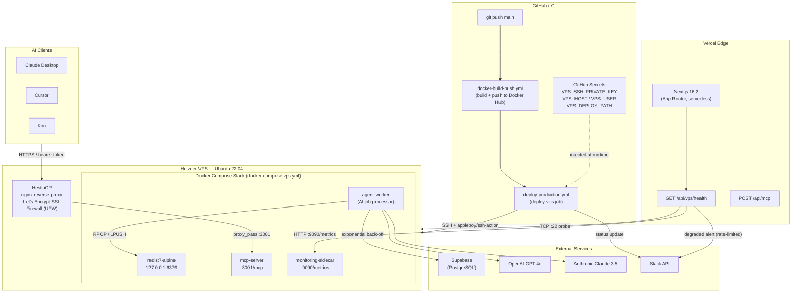
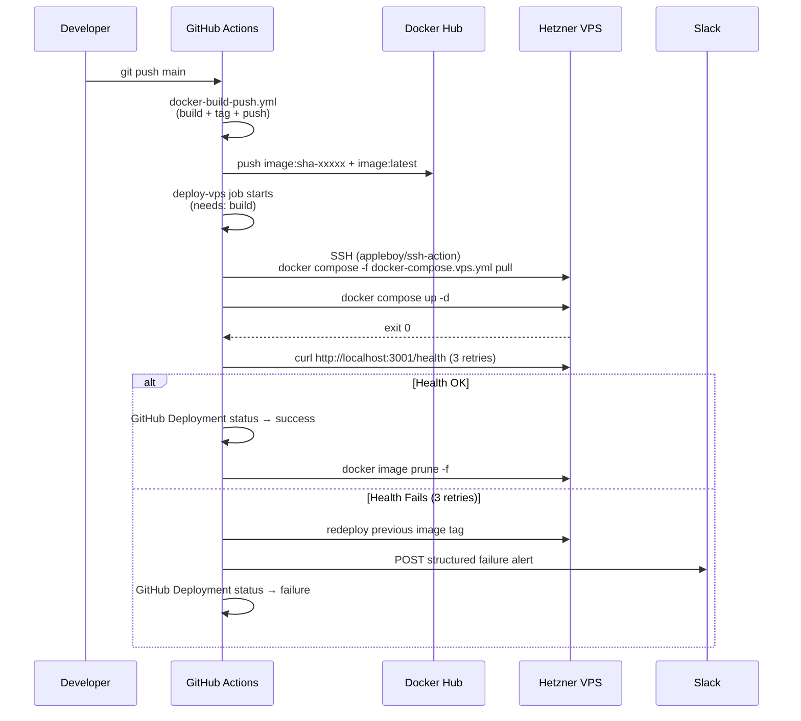
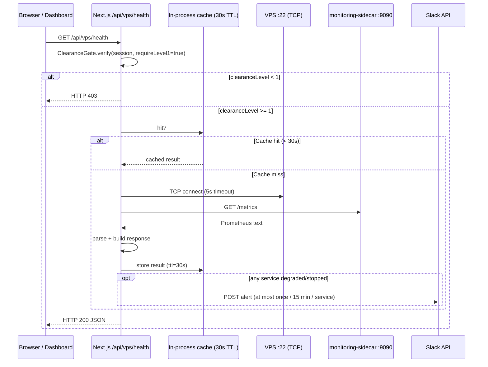

# Design Document: VPS Workspace Integration

## Overview

This document describes the technical design for integrating a Hetzner VPS (Ubuntu 22.04, HestiaCP) into the imperial_codex workspace as a persistent compute layer alongside Vercel's serverless functions.

The VPS serves three distinct roles:

1. **Persistent runtime** — hosts long-running services (Redis, AI agent workers) that cannot run under Vercel's function timeout limits.
2. **Protocol server** — exposes an MCP endpoint at a stable public URL for AI clients (Claude Desktop, Cursor, Kiro).
3. **Deployment target** — receives automated Docker-based deploys from the existing GitHub Actions CI/CD pipeline via SSH.

The design is deliberately additive: nothing in the existing Vercel deployment path, Supabase schema, or Next.js application is removed. The VPS is a new target that the pipeline also deploys to.

---

## Architecture

### System Overview



### Request Flow: VPS Deployment



### Request Flow: Health API Route



---

## Components and Interfaces

### 1. SSH Key Manager (`infrastructure/hetzner-vps/`)

Responsible for documenting and scripting the key lifecycle. Not a runtime service — the actual SSH operations are performed by `appleboy/ssh-action` in GitHub Actions.

**Key pairs:**

| Key                       | Purpose                                      | Stored in                                        |
| ------------------------- | -------------------------------------------- | ------------------------------------------------ |
| `id_ed25519_vps_deploy`   | Admin deploy user (pull images, run compose) | GitHub secret `VPS_SSH_PRIVATE_KEY`              |
| `id_ed25519_vps_readonly` | Read-only repo clone on VPS                  | GitHub secret `VPS_DEPLOY_KEY` / repo deploy key |

Public halves are placed in `~/.ssh/authorized_keys` for the `deploy` user on the VPS during `setup.sh`.

**Key rotation procedure** (documented in `README.md`):

1. Generate new Ed25519 keypair locally.
2. Append new public key to `~/.ssh/authorized_keys` on VPS.
3. Update `VPS_SSH_PRIVATE_KEY` in GitHub Actions secrets.
4. Verify a test SSH connection succeeds.
5. Remove the old public key from `authorized_keys`.

### 2. Docker Compose VPS Stack (`docker-compose.vps.yml`)

Defines four services with explicit resource limits, restart policies, and network isolation.

**Service definitions:**

| Service              | Image                                 | Port binding          | Restart          |
| -------------------- | ------------------------------------- | --------------------- | ---------------- |
| `redis`              | `redis:7-alpine`                      | `127.0.0.1:6379:6379` | `unless-stopped` |
| `agent-worker`       | `imperial-codex:latest`               | (none public)         | `unless-stopped` |
| `mcp-server`         | `imperial-codex:latest`               | `127.0.0.1:3001:3001` | `unless-stopped` |
| `monitoring-sidecar` | `prom/node-exporter:latest` or custom | `127.0.0.1:9090:9090` | `unless-stopped` |

Redis is bound to `127.0.0.1` — it is never reachable from outside the VPS. The MCP server and monitoring sidecar are also bound locally; HestiaCP's nginx reverse proxy handles external exposure.

**Resource limits per service:**

```yaml
deploy:
  resources:
    limits:
      cpus: "0.50"
      memory: 512M
```

Exact values are tuned to the server SKU (CX23: 3 vCPU / 4 GB RAM). Redis gets 256 MB, agent-worker 1 GB, mcp-server 512 MB, monitoring-sidecar 128 MB.

### 3. GitHub Actions: `deploy-vps` Job

Added to `deploy-production.yml` as a new job with `needs: build` (the existing `docker-build-push.yml` workflow must succeed first via `workflow_call`).

**Job structure:**

```yaml
deploy-vps:
  needs: build
  runs-on: ubuntu-latest
  environment: vps-production
  steps:
    - uses: appleboy/ssh-action@<pinned-sha>
      with:
        host: ${{ secrets.VPS_HOST }}
        username: ${{ secrets.VPS_USER }}
        key: ${{ secrets.VPS_SSH_PRIVATE_KEY }}
        script: |
          cd ${{ secrets.VPS_DEPLOY_PATH }}
          docker compose -f docker-compose.vps.yml pull
          docker compose -f docker-compose.vps.yml up -d --remove-orphans
          # health check with retries
          for i in 1 2 3; do
            curl -sf http://localhost:3001/health && break || sleep 5
          done || (docker compose -f docker-compose.vps.yml rollback && exit 1)
          docker image prune -f
```

The `appleboy/ssh-action` version is pinned to a specific commit SHA (not `@master`) to prevent supply-chain drift.

**Required GitHub secrets:**

| Secret                | Description                                   |
| --------------------- | --------------------------------------------- |
| `VPS_SSH_PRIVATE_KEY` | Ed25519 private key, PEM format               |
| `VPS_HOST`            | Public IP or FQDN of the VPS                  |
| `VPS_USER`            | SSH username (e.g., `deploy`)                 |
| `VPS_DEPLOY_PATH`     | Absolute path to the compose directory on VPS |
| `SLACK_ALERT_CHANNEL` | Slack webhook URL for failure alerts          |

### 4. Health Monitor (`src/app/api/vps/health/route.ts`)

A Next.js App Router route handler that:

- Enforces Clearance Level ≥ 1 via the existing `ClearanceGate`
- Performs a TCP connect to VPS port 22 (5-second timeout) via Node's `net.createConnection`
- Fetches Prometheus metrics from the monitoring-sidecar
- Returns a structured JSON response
- Caches the combined result for 30 seconds using an in-process Map with a timestamp check (edge-compatible; no external cache dependency)
- Rate-limits Slack alerts to once per 15 minutes per service key

**Response schema:**

```typescript
interface VpsHealthResponse {
  status: "healthy" | "degraded" | "unreachable";
  checkedAt: string; // ISO 8601
  ssh: {
    reachable: boolean;
    latencyMs?: number;
  };
  services: ServiceStatus[];
}

interface ServiceStatus {
  name: string; // "redis" | "agent-worker" | "mcp-server" | "monitoring-sidecar"
  status: "running" | "stopped" | "restarting";
  degraded: boolean; // true if restartCount > 5 in last 10 min
  restartCount: number;
  cpuPercent?: number;
  memoryMb?: number;
}
```

**Clearance enforcement** follows the existing `ClearanceGate` pattern used in other protected routes:

```typescript
const gate = await clearanceGate.verify(session, "/api/vps/health", true);
if (!gate.granted) {
  return Response.json({ error: gate.code }, { status: 403 });
}
```

### 5. MCP Server Service (`docker-compose.vps.yml` → `mcp-server`)

Runs the same `imperial-codex` image but starts with the MCP server entrypoint rather than the Next.js web server. Listens on port `3001`, implementing MCP at `/mcp`.

HestiaCP nginx configuration:

```nginx
location /mcp {
    proxy_pass http://127.0.0.1:3001;
    proxy_set_header Host $host;
    proxy_set_header X-Real-IP $remote_addr;
}
```

Bearer token validation is enforced at the MCP server application layer. The token is passed via the `MCP_SERVER_TOKEN` environment variable (injected via Docker Compose `env_file`).

### 6. HestiaCP Configuration (`infrastructure/hetzner-vps/`)

HestiaCP manages:

- nginx virtual hosts and reverse proxy rules
- Let's Encrypt certificate lifecycle (auto-renew via cron)
- DNS records (if using Hetzner DNS via HestiaCP)
- UFW firewall rules (port 8083 restricted to management IP allowlist)

The `setup.sh` script handles everything that HestiaCP does **not** manage: Docker Engine, Docker Compose v2, the deploy user account, SSH hardening, and placing the compose files.

---

## Data Models

### VPS Environment Variables (injected via `.env.vps` / Docker Compose `env_file`)

```
# Shared across services
REDIS_URL=redis://redis:6379

# agent-worker
OPENAI_API_KEY=...
ANTHROPIC_API_KEY=...
SUPABASE_URL=...
SUPABASE_SERVICE_ROLE_KEY=...

# mcp-server
MCP_SERVER_TOKEN=...
MCP_SERVER_PORT=3001

# monitoring
METRICS_PORT=9090
```

None of these values are committed to the repository. They are stored in GitHub Actions secrets and written to the VPS via the `setup.sh` script or a dedicated secrets-sync step.

### GitHub Actions Secrets Map

```
VPS_SSH_PRIVATE_KEY     → appleboy/ssh-action key parameter
VPS_HOST                → appleboy/ssh-action host parameter
VPS_USER                → appleboy/ssh-action username parameter
VPS_DEPLOY_PATH         → remote cd target
VPS_DEPLOY_KEY          → read-only GitHub deploy key (repo clone on VPS)
SLACK_ALERT_CHANNEL     → Slack incoming webhook URL
```

### Deployment Status Payload (GitHub Deployments API)

```typescript
interface DeploymentStatusPayload {
  state: "success" | "failure" | "in_progress";
  environment_url: string; // "https://mcp.imperial-codex.dalizebo.com"
  description: string; // "VPS deployment succeeded" | "VPS deployment failed: <reason>"
  auto_inactive: boolean; // true
}
```

### Slack Alert Payload (failure / degraded service)

```typescript
interface SlackAlertPayload {
  text: string;
  blocks: [
    {
      type: "section";
      text: {
        type: "mrkdwn";
        text: string; // contains: job name, repo, run URL, error reason
      };
    },
  ];
}
```

---

## Correctness Properties

_A property is a characteristic or behavior that should hold true across all valid executions of a system — essentially, a formal statement about what the system should do. Properties serve as the bridge between human-readable specifications and machine-verifiable correctness guarantees._

This feature's logic falls into two categories:

- **Infrastructure configuration** (Docker Compose YAML, GitHub Actions YAML, shell scripts, HestiaCP setup): these are best verified with schema validation, smoke tests, and idempotency integration tests — not property-based testing.
- **Application logic** (health route, retry logic, auth middleware, notification formatters, caching): these contain pure or near-pure functions whose correctness properties hold across all valid inputs.

The properties below target the application logic layer.

---

### Property 1: SSH failure log emission

_For any_ sequence of exactly 3 consecutive SSH connection failure reasons (as arbitrary non-empty strings), the SSH_Manager SHALL emit a structured log entry that contains all three required fields: `timestamp`, `targetHost`, and `failureReason`.

**Validates: Requirements 1.5**

---

### Property 2: Rollback triggered after 3 consecutive health check failures

_For any_ sequence of 3 consecutive non-2xx HTTP response codes from the post-deployment health check probe, the deploy pipeline's rollback function SHALL be invoked exactly once, regardless of whether the subsequent Slack notification call succeeds or fails.

**Validates: Requirements 2.4**

---

### Property 3: Agent Worker retry queue placement on exhausted retries

_For any_ AI job and _for any_ sequence of Supabase write failures that exhausts all retries (max 2 retries with back-off base 500 ms, cap 5000 ms), the Agent_Worker SHALL place the original job back on the Redis retry queue and SHALL NOT discard it.

**Validates: Requirements 3.4**

---

### Property 4: MCP Server bearer token validation

_For any_ bearer token string, if the token does not exactly match `MCP_SERVER_TOKEN`, the MCP server SHALL return HTTP 401 and SHALL NOT invoke any registered tool handler. If the token matches, the request SHALL proceed to the handler.

**Validates: Requirements 3.6**

---

### Property 5: GitHub deployment status payload correctness

_For any_ deployment outcome (success or failure) and _for any_ non-empty VPS IP or FQDN string, the GitHub Deployments API payload SHALL contain the correct `state` field (`"success"` or `"failure"`) and the VPS address as the `environment_url`.

**Validates: Requirements 4.5**

---

### Property 6: Slack notification contains all required fields

_For any_ deployment failure reason string, the Slack notification payload SHALL always include: the GitHub job name, repository slug, Actions run URL, and the failure reason string — regardless of the content of those strings (including empty repo names or URLs with special characters).

**Validates: Requirements 4.6**

---

### Property 7: Health API response shape invariant

_For any_ VPS connectivity state (reachable or unreachable) and _for any_ set of service statuses (including the empty set), the `GET /api/vps/health` response SHALL always be HTTP 200 with a JSON body containing a top-level `"status"` string field and a `"services"` array (which may be empty). A 5xx response SHALL never be returned.

**Validates: Requirements 5.1, 5.6**

---

### Property 8: TCP probe enforces 5-second timeout

_For any_ TCP connection attempt to the VPS port 22 that does not complete within 5000 milliseconds, the probe function SHALL resolve to `{ reachable: false }` rather than hanging or throwing an unhandled rejection.

**Validates: Requirements 5.2**

---

### Property 9: Clearance level gate on health route

_For any_ session with `clearanceLevel < 1` (including unauthenticated sessions), `GET /api/vps/health` SHALL return HTTP 403 and SHALL NOT open a TCP connection or fetch metrics. _For any_ session with `clearanceLevel >= 1`, the route SHALL proceed to the probe logic.

**Validates: Requirements 5.4**

---

### Property 10: Health probe result cached within 30-second window

_For any_ sequence of N ≥ 2 calls to `GET /api/vps/health` made within a 30-second window by a session with sufficient clearance, the underlying TCP probe function and the metrics fetch SHALL each be invoked exactly once, not N times.

**Validates: Requirements 5.5**

---

### Property 11: Degraded flag and warning log always set together

_For any_ service whose restart count exceeds 5 within the last 10-minute window, the health route handler SHALL simultaneously set `"degraded": true` in the service's response object AND emit a structured warning log. These two side effects SHALL always occur together — never one without the other.

**Validates: Requirements 5.7**

---

### Property 12: Slack degraded alert rate-limited to once per 15-minute window per service

_For any_ sequence of health check responses that include a degraded or stopped service, the Slack alert for that specific service key SHALL be posted at most once within any sliding 15-minute window, regardless of how many health check calls occur in that window.

**Validates: Requirements 5.8**

---

## Error Handling

### SSH Connection Failures

The `appleboy/ssh-action` step fails the GitHub Actions job on non-zero exit. The deploy pipeline then:

1. Sets GitHub Deployment API status to `failure`.
2. Posts a structured alert to `SLACK_ALERT_CHANNEL`.
3. Does **not** attempt rollback (no previous running container to roll back to if SSH is unreachable).

For application-side SSH probing (the health route), connection failures are caught and returned as `{ reachable: false }` — no 5xx is propagated to the caller (Property 7).

### Docker Compose Deployment Failures

If `docker compose up -d` exits non-zero, the deploy script retries the health check up to 3 times (5-second delay between attempts). If all 3 fail, it executes `docker compose rollback` (re-pulls and starts the previous image tag stored in the `PREVIOUS_TAG` env var set at the start of the deploy step).

### Agent Worker Retry Logic

Supabase write failures use the existing project-wide exponential back-off: base 500 ms, cap 5000 ms, max 2 retries (matching the convention in `tech.md`). After exhaustion, the job is placed on `retry:queue` in Redis rather than discarded. A separate dead-letter consumer (future work) can process `retry:queue`.

### Health Route Edge Cases

| Condition                        | Behaviour                                               |
| -------------------------------- | ------------------------------------------------------- |
| VPS SSH port unreachable         | HTTP 200, `{ "status": "unreachable", "services": [] }` |
| Monitoring sidecar unreachable   | HTTP 200, services listed with `"status": "unknown"`    |
| Session missing or clearance < 1 | HTTP 403                                                |
| Cache populated, VPS rebooting   | Stale cache returned until TTL expires (max 30 s lag)   |

### HestiaCP / nginx Failures

Let's Encrypt renewal failures are handled by HestiaCP's built-in retry cron. If nginx fails to reload after cert renewal, HestiaCP sends an email to the admin address configured during initial setup. This is outside the application's error handling scope.

---

## Testing Strategy

### Unit Tests (Jest + ts-jest)

Focused on specific examples and edge cases for the application-layer components:

- `VpsHealthRoute`: mock `net.createConnection` and monitoring-sidecar fetch; verify correct JSON shape for reachable, unreachable, and degraded states.
- `ClearanceGate` integration with health route: verify 403 for levels 0 and unauthenticated, 200 for level 1+.
- `SlackNotifier.formatDeploymentFailure`: verify payload shape for various input strings.
- `GitHubDeploymentStatus.build`: verify correct `state` and `environment_url` mapping.
- `AgentWorkerRetry`: verify retry queue placement after exhaustion using mocked Redis and Supabase clients.

### Property-Based Tests (fast-check)

One property-based test per correctness property listed above. Each test runs a minimum of 100 iterations.

Tag format per test: `// Feature: vps-workspace-integration, Property N: <property text>`

Key generators needed:

- `fc.string({ minLength: 1 })` for failure reasons, bearer tokens, IP strings
- `fc.integer({ min: 0, max: 503 })` for HTTP status codes
- `fc.array(fc.record({ name: fc.string(), status: fc.constantFrom('running', 'stopped', 'restarting'), restartCount: fc.integer({ min: 0, max: 20 }) }))` for service status arrays
- `fc.integer({ min: 0, max: 2 })` for clearance levels
- `fc.date()` for timestamp generation in rate-limit tests

Example property test structure:

```typescript
// Feature: vps-workspace-integration, Property 7: Health API response shape invariant
it("always returns HTTP 200 with status and services fields", () => {
  fc.assert(
    fc.asyncProperty(
      fc.boolean(), // isReachable
      fc.array(serviceStatusArb),
      async (isReachable, services) => {
        mockTcpProbe.mockResolvedValue({ reachable: isReachable });
        mockMetricsFetch.mockResolvedValue(services);
        const res = await GET(mockRequest({ clearanceLevel: 1 }));
        expect(res.status).toBe(200);
        const body = await res.json();
        expect(typeof body.status).toBe("string");
        expect(Array.isArray(body.services)).toBe(true);
      },
    ),
    { numRuns: 100 },
  );
});
```

### Integration Tests

Run in CI against a Docker Compose test environment (not the live VPS):

- `setup.sh` idempotency: run twice in a Docker container with Ubuntu 22.04, assert exit 0 and identical final state.
- `docker-compose.vps.yml` schema: parse YAML and assert all services have `mem_limit`, `cpus`, `restart: unless-stopped`.
- MCP server TLS: `curl https://mcp.imperial-codex.dalizebo.com` returns non-5xx with valid certificate (run against staging domain post-deploy).

### Smoke Tests (CI Pipeline)

These checks run as part of the `deploy-vps` job or a post-deploy verification step:

- `VPS_SSH_PRIVATE_KEY` secret is non-empty (asserted in workflow via `if: env.VPS_SSH_PRIVATE_KEY == ''`).
- `docker-compose.vps.yml` contains `restart: unless-stopped` for all named services.
- `PasswordAuthentication no` present in `/etc/ssh/sshd_config` on VPS.
- HestiaCP port 8083 is not accessible from `0.0.0.0` (verified via nmap in setup.sh or post-deploy check).

---

## Infrastructure Scripts

### `infrastructure/hetzner-vps/setup.sh`

Idempotent provisioning script. Key sections:

```bash
# 1. System packages
apt-get install -y curl git unzip

# 2. Docker Engine (idempotent — checks if already installed)
if ! command -v docker &>/dev/null; then
  curl -fsSL https://get.docker.com | sh
fi

# 3. Docker Compose v2 plugin
if ! docker compose version &>/dev/null; then
  apt-get install -y docker-compose-plugin
fi

# 4. deploy user
id deploy &>/dev/null || useradd -m -s /bin/bash deploy
usermod -aG docker deploy

# 5. SSH hardening
sed -i 's/^#\?PasswordAuthentication.*/PasswordAuthentication no/' /etc/ssh/sshd_config
systemctl reload sshd

# 6. HestiaCP domain and SSL (idempotent — v-* commands are no-ops if already configured)
v-add-user deploy deploy@example.com default || true
v-add-domain deploy mcp.imperial-codex.dalizebo.com || true
v-add-letsencrypt-domain deploy mcp.imperial-codex.dalizebo.com || true

# 7. Compose directory
mkdir -p /opt/imperial-codex
chown deploy:deploy /opt/imperial-codex
```

### `infrastructure/hetzner-vps/README.md`

Documents:

- Hetzner server specs (SKU, region, OS)
- HestiaCP version and admin URL
- Installed services and their ports
- GitHub Actions secrets required
- Manual post-script steps (DNS propagation confirmation, Slack webhook setup)
- Key rotation procedure
- HestiaCP upgrade checklist
